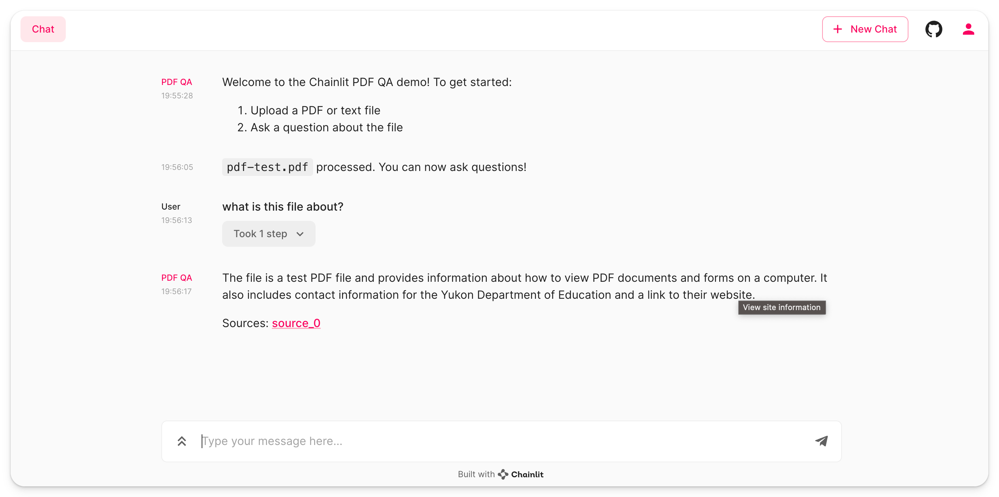

# Documate: A must have AGI tool for every organization who documents their organizational knowledge base.

The tool offers the following features

- Have your own organizations Cognitive mind which can reason and present facts 
    - Upload any pdf file to add to your organization knowledge graph / base
    - Annotate relationships collaboratively to make sure knowledge graph is well curated with evidence
    - Explore and reason your knowledge graph /base to unearth hidden relationships and impacts
    - Simulate situations to obtain insights from your documate assistant.

To run the example, follow the instructions of the [main readme](/README.md).

Title: PDF Question & Answering
Tags: [pdf, q&a]